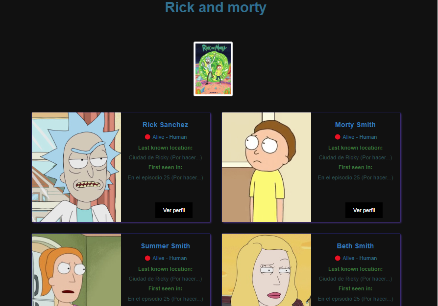

Proyecto
Para nuestro proyecto final, haremos uso de la API "Rick and Morty".

Requerimientos
Hacer uso de la API y extraer todos los personajes de la página 1 a la 21. Para extraer personajes por página, use la siguiente ruta.

​https://rickandmortyapi.com/api/character?page=n
Donde "n" es el número de página.

Debe insertar los datos obtenidos en una colección de MongoDB.

La estructura del Json obtenido es el siguiente:

{
    info:{ "Información de la página, conteo de personajes, página siguiente y anterior, etc." },
    results:{ "Array de personajes" }
}
Únicamente debe insertar los results en la base de datos.

Crearemos la siguiente vista HTML haciendo uso de PyMongo. (No centrarse en lo visual, lo importante es que retornen los datos de los personajes en pantalla).

Grid

Los personajes deben estar ordenados por el id de forma descendente.

Perfil
Crear un perfil en el que se pueda visualizar más datos del personaje: Capitulos en los que aparece, etc.

La vista debe ser similar a la de perfil que ya trabajamos.

Perfil

Con la diferencia que deben estar los datos del personaje.

Presentación
Indicar el tipo de querys que se utilizaron y el por qué.

Mostrar el script de Python para obtener todos los personajes.
